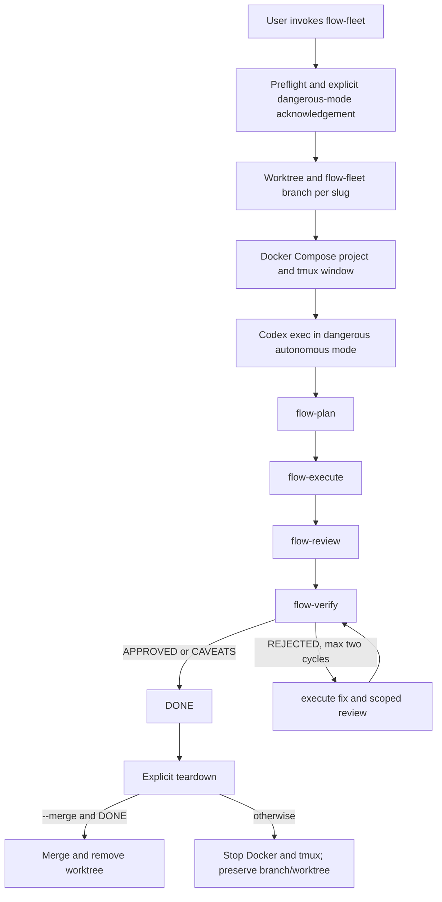

# PWDEV Flow Marco 5 Design

## Objective

Add operational parity with PWDEV Code for autonomous fleet orchestration and external coding CLI delegation, adapted to Codex while preserving the PWDEV Flow artifact protocol. The fleet intentionally uses Codex dangerous mode after explicit user authorization; standalone delegation remains confirmation-gated and independently reviewed.

## Approved decisions

- Preserve the PWDEV Code Bash, tmux, Docker Compose, Git worktree, dashboard, and teardown operating model.
- Replace `claude -p --permission-mode bypassPermissions` with `codex exec --dangerously-bypass-approvals-and-sandbox --ephemeral` for autonomous fleet stages.
- Keep new portable and operational state under `.planning/flow/`.
- Commit stage results automatically only inside fleet branches.
- Never merge a fleet branch without an explicit `--merge` request and a `DONE` status.
- Keep dangerous mode exclusive to autonomous fleet stages. Standalone external delegation does not inherit it.
- Test dangerous behavior through dry runs and fake executables; never launch a real dangerous fleet while validating the plugin.

## Scope

Marco 5 adds two skills:

- `flow-fleet` — launch, inspect, and tear down parallel phase pipelines in isolated worktrees, Docker Compose projects, and tmux windows;
- `flow-delegate` — select or explicitly invoke Codex, OpenCode, Kimi, Gemini, or Kiro through one guarded delegation protocol.

It adds five executable scripts:

- `fleet-up.sh` — preflight, capacity and port allocation, worktree creation, approved-contract adoption, Docker startup, tmux startup, and central bookkeeping;
- `fleet-run.sh` — autonomous `PLAN → EXECUTE → REVIEW → VERIFY` pipeline with structured Codex results, automatic stage commits, and at most two correction cycles;
- `fleet-dashboard.sh` — one-shot or live fleet status table;
- `fleet-teardown.sh` — Docker/tmux shutdown and optional status-gated merge/worktree cleanup;
- `run-agent.sh` — allowlisted standalone external CLI execution with timeout, write lock, read-only mutation detection, output capture, and audit metadata.

The plugin also gains:

- `references/fleet.md` and `references/delegation.md`;
- a generic Docker Compose template;
- a non-secret fleet environment example that is copied, never read from a project;
- a JSON Schema for Codex stage results;
- compatibility routes for legacy fleet and provider commands;
- structural and behavioral tests for the new scripts.

No hooks, MCP servers, apps, services, installers, or real provider credentials are added.

## Architecture



Skills own user intent, confirmation, reporting, and mandatory review. Scripts own deterministic lifecycle transitions and shell command construction. Existing canonical Flow skills continue to own phase contracts; the fleet prompt only overrides interactive approval pauses inside an already approved and isolated phase pipeline.

## Artifact and configuration protocol

Central fleet bookkeeping lives in the initiating repository:

```text
.planning/flow/fleet/<slug>.json
.planning/flow/fleet/<slug>.pane.sh
```

Per-worktree state lives inside the worktree:

```text
.planning/flow/fleet-status.json
.planning/flow/fleet-logs/<stage>-<timestamp>.log
.planning/flow/fleet-results/<stage>-<timestamp>.json
```

Standalone delegation outputs live at:

```text
.planning/flow/delegation/<timestamp>-<agent>.md
.planning/flow/delegation/.lock
```

The optional configuration shape is:

```json
{
  "fleet": {
    "max_concurrent": 3,
    "port_base_app": 3000,
    "port_base_db": 5432,
    "port_step": 10,
    "permission_mode": "danger-full-access",
    "auto_simplify": false,
    "compose_file": "docker-compose.flow-fleet.yml"
  },
  "external_models": {
    "codex": {"timeout_s": 600},
    "opencode": {"model": "provider/model", "timeout_s": 600},
    "kimi": {"timeout_s": 900},
    "gemini": {"model": "provider/model", "timeout_s": 600},
    "kiro": {"timeout_s": 900}
  }
}
```

Unknown configuration fields are preserved. Extra CLI arguments, when supported, are represented as a JSON array and passed as argument-vector elements; scripts never evaluate configuration as shell code.

`permission_mode: "danger-full-access"` is required for fleet launch. The skill must show the exact Codex dangerous flag and obtain explicit acknowledgement before persisting a missing fleet block or launching the first member. A different value is rejected rather than silently upgraded.

## Fleet lifecycle

### Entry gate

Require:

- Git repository with a named current branch;
- locally available `git`, `jq`, `tmux`, `docker`, and `codex`;
- Docker Compose support;
- one to `fleet.max_concurrent` valid lowercase Flow slugs;
- approved `.planning/flow/phases/<slug>/spec.md` and `decisions.md`;
- no existing bookkeeping entry, branch, or worktree collision;
- free deterministic app and database ports;
- explicit acknowledgement of `--dangerously-bypass-approvals-and-sandbox`.

The independence scan is advisory. It warns when requested specifications mention overlapping paths or keywords, but the human decides whether to proceed.

### Launch

Allocate the first unused port index under a mkdir lock. Create branch `flow-fleet/<slug>` and a sibling worktree. If approved Flow contracts are not present in `HEAD`, copy only the exact approved `spec.md` and `decisions.md` into the worktree and commit them there; never stage or commit the initiating working tree.

Generate `.env.fleet` within the worktree and copy `docker-compose.flow-fleet.yml`. Start the full Compose project when a Dockerfile exists; otherwise start only the database service. Create the shared `pwdev-flow-fleet` tmux session, its dashboard window, and a slug window running `fleet-run.sh`. Persist central bookkeeping only after launch metadata is known.

### Autonomous runner

For every stage, run Codex with:

```text
codex exec --dangerously-bypass-approvals-and-sandbox --ephemeral \
  --cd <worktree> --output-schema <fleet-result-schema> \
  --output-last-message <result-file> <autonomous-prompt>
```

The prompt invokes the canonical installed skill for the stage and permits the best-judgment default at interactive approval gates. It does not override destructive-action prohibitions, missing prerequisites, secret restrictions, or explicit stop conditions.

The result schema requires `stage`, `status`, `message`, and `verdict`. Allowed status values are `OK`, `FAILED`, and `NEEDS_HUMAN`; verification verdicts are `APPROVED`, `CAVEATS`, or `REJECTED`. Invalid JSON, schema mismatch, non-zero Codex exit, missing expected artifacts, or an explicit stop result moves the member to `NEEDS_HUMAN`.

After a successful stage, commit all scoped worktree changes with a stage-specific message. The main working tree is never committed, merged, or modified by the runner.

Run `flow-plan`, `flow-execute`, `flow-review`, and `flow-verify` sequentially. A rejected verification runs `flow-execute --fix`, a scoped `flow-review`, and `flow-verify` again. Stop after two rejected correction cycles.

### Dashboard

Render slug, app/database ports, stage, status, branch, updated timestamp, and a truncated message. `--once` prints and exits; live mode refreshes every five seconds inside tmux. Never copy full logs or prompts into the central dashboard.

### Teardown and merge

Teardown always attempts Docker Compose shutdown and tmux window termination. Without `--merge`, preserve branch and worktree. With `--merge`, require worktree status `DONE`; otherwise refuse the merge and preserve both.

For `DONE`, merge using `--no-ff`. On conflict, abort the merge and preserve branch and worktree. Remove the worktree and central bookkeeping only after a successful merge. Teardown supports `DRY_RUN=1`, which prints exact commands without mutation.

## Standalone external delegation

`flow-delegate` supports explicit provider selection and automatic routing:

| Task type | Provider | Default mode |
|---|---|---|
| Objective implementation, bug fix, bounded tests | Codex | write |
| Explicit provider/model or routing flexibility | OpenCode | write |
| Large repository or extensive refactor | Kimi | write |
| Analysis, architecture, documentation, second opinion | Gemini | read |
| Agentic/spec-driven or AWS work | Kiro | write |

The skill announces the selected provider and reason, checks the binary, records Git baseline, shows the exact command, and requires confirmation before the first external run in the session. The runner accepts only `codex`, `opencode`, `kimi`, `gemini`, and `kiro` plus `read` or `write` mode.

Write mode uses a single mkdir lock. Read mode compares `git status --porcelain` before and after the run, excluding only its own delegation output directory; any difference returns a read-only violation. Use `timeout` or `gtimeout` when available and report when neither is available. Standard exit codes cover invalid input, read-only violation, active lock, timeout, and missing binary.

Standalone Codex delegation does not add the fleet dangerous flag. Kiro receives `--trust-all-tools` only in write mode. Prompts prohibit secrets, commits, pushes, branches, global installs, external writes, and drive-by changes.

After every delegation, the primary Codex instance must inspect status and the full diff, check scope, run relevant tests itself, and produce an independent verdict. Delegated summaries are evidence inputs, never completion proof.

## Compatibility

Update `flow-compat` as follows:

| Legacy command | Flow route |
|---|---|
| `fleet` | `flow-fleet` |
| `delegate` | `flow-delegate` auto-selection |
| `codex` | `flow-delegate` with Codex |
| `opencode` | `flow-delegate` with OpenCode |
| `kimi` | `flow-delegate` with Kimi |
| `gemini` | `flow-delegate` with Gemini |
| `kiro` | `flow-delegate` with Kiro |

Compatibility translates intent and arguments but writes only Flow paths. It does not reuse PWDEV Code fleet bookkeeping, Docker projects, tmux sessions, branches, or locks.

## Audit

Extend the semantic audit vocabulary with `fleet_launched`, `fleet_stage`, `fleet_teardown`, and `external_run`. Record only slug, stage, status, provider, mode, exit code, timeout, and safe relative targets. Never record prompts, stdout, environment variables, models, worktree absolute paths, credentials, or generated `.env.fleet` content.

## Failure handling

- Missing dependency, invalid slug, capacity exhaustion, port conflict, or collision fails before launch mutation.
- An active allocation or write lock refuses concurrent mutation.
- Partial launch writes `NEEDS_HUMAN` with the resources known to exist and exact teardown guidance.
- Invalid Codex results, missing stage artifacts, failed commits, or correction exhaustion halt the runner.
- Teardown failure preserves bookkeeping until cleanup can be verified.
- A non-`DONE` member never merges.
- Merge conflict aborts and preserves recoverable state.
- Standalone read-mode mutation returns a violation and never reverts automatically.
- Scripts never delete unknown files, use recursive cleanup on unresolved paths, or read project secret files.

## Testing strategy

All behavior tests run in temporary Git repositories. Fake binaries stand in for Codex, Docker, tmux, jq-dependent external providers, and timeout tools. Tests assert real script outputs, state files, exit codes, and Git effects rather than source text.

Required fleet tests cover:

- exact dangerous Codex argument vector in `DRY_RUN` or fake-run output;
- slug, prerequisite, capacity, collision, and port validation;
- deterministic port allocation and bookkeeping;
- approved-contract adoption without modifying the initiating tree;
- stage order, structured result validation, stage commits, and `DONE`;
- two correction cycles followed by escalation;
- one-shot dashboard output;
- teardown without merge, merge refusal, successful merge, and conflict preservation;
- partial-launch `NEEDS_HUMAN` state.

Required delegation tests cover:

- provider and mode allowlists;
- provider-specific argument vectors;
- timeout and missing-binary exit codes;
- exclusive write lock;
- read-only mutation detection;
- output capture without secret content;
- safe JSON-array extra arguments with no shell evaluation.

Structural tests require seventeen valid skills, sixteen references, seven scripts, packaged templates/schema, resolved Markdown links, no hooks/MCP/apps, and manifest base version `0.5.0` with one Codex cachebuster.

The validation process never runs a real dangerous fleet, Docker project, tmux session, external model, merge, or provider network call.

## Version and acceptance

Set the manifest base version to `0.5.0`, run the official cachebuster helper once, and reinstall from the existing local `pwdev-flow` marketplace without hand-editing marketplace configuration.

Marco 5 is accepted when:

- `flow-fleet` and `flow-delegate` pass the official skill validator;
- all existing fifteen skills continue to pass, for seventeen total;
- fleet and delegation behavioral suites pass using controlled fakes;
- the original Marco 1–4 suites remain green;
- plugin validation, link scans, placeholder scans, whitespace checks, runtime-path checks, and dangerous-mode boundary checks pass;
- the installed cache is identical to the source;
- no real dangerous fleet or external provider was launched during implementation;
- no unrelated working-tree change was modified;
- no commit, push, branch, merge, or marketplace hand-edit was performed while implementing the plugin.
